# AOSC 操作系统分析报告

> 本文档基于 AOSC 官方 Wiki 及公开资料，从多个维度详细介绍 AOSC 操作系统。

## 目录

- [系统概述](#系统概述)
- [核心设计理念](#核心设计理念)
- [系统定制化特性](#系统定制化特性)
- [用户群体分析](#用户群体分析)
- [发展历程与核心成果](#发展历程与核心成果)
- [支持的硬件平台](#支持的硬件平台)
- [对 Linux 生态的贡献](#对-linux-生态的贡献)
- [可借鉴的技术与模式](#可借鉴的技术与模式)
- [AOSC非包管理项目分析](#aosc非包管理项目分析)
- [结语](#结语)

---

## 系统概述

AOSC（全称"安同操作系统"，AOSC OS）是一个由中国团队主导、始于 2008 年的**自主构建的通用 Linux 发行版**。它并非基于任何现有主流发行版（如 Debian、Fedora 等）进行"二次开发"，而是从内核、核心库（如 `glibc`）、工具链到上层应用均通过自主构建系统编译维护，形成了独立完整的软件生态。

### 设计目标

AOSC 旨在提供一个兼容 POSIX 标准、对多硬件架构友好、且深度适配中文环境的通用操作系统，覆盖桌面、服务器、嵌入式等多元应用场景。

---

## 核心设计理念

AOSC 的设计理念贯穿其发展全程，可归纳为四大核心理念：

### 1. 通用优先，兼容为本

- 遵循 POSIX 标准，确保与 Linux 生态主流软件兼容
- 打破"单一架构依赖"，支持多硬件平台（从 x86 到国产芯片）
- 提供统一的用户体验，无论底层硬件架构如何变化

### 2. 本地化深度适配

- 将中文用户体验作为核心目标，而非简单的"国际化系统+中文语言包"模式
- 从字体渲染、输入法到本土软件（如 WPS、微信）均做深度优化
- 解决中文环境下的特有问题，如字符编码、显示效果等

### 3. 自主可控的构建闭环

- 通过自研工具链（`ACBS`、`autobuild4`、`ciel`）和包管理器（`oma`）
- 实现从源码到软件包的全流程自主管理
- 避免对上游发行版工具的依赖，确保系统发展的自主性

### 4. 社区驱动，开源透明

- 坚持自由软件理念（代码遵循 GPL 等协议）
- 开发过程完全公开，鼓励社区贡献
- 形成"开发者+用户"协同迭代的良性循环模式

---

## 系统定制化特性

AOSC 的定制化体现在系统全栈，主要包括以下几个方面：

### 1. 包管理与构建系统

#### 包管理流程核心组件

AOSC 包管理流程围绕"**构建-分发-用户管理-依赖保障**"四大核心环节展开，组件构成与职责完全基于官方 repo 真实软件定义：

##### 一、构建环节：从源码到软件包的核心支撑

构建环节负责将源码通过标准化流程编译为可安装的 `.deb` 包，是包管理的起点，核心组件及职责如下：

1. **构建框架核心工具**

   - **acbs**（AOSC Build Service）
     核心职责：管理软件包构建树（如 `aosc-os-abbs`），协调构建流程与依赖关系，支持多构建树管理、校验和自动验证及构建序列计算，确保不同开发者构建的包一致性。
     关键特点：通过统一配置规范，解决多架构（如 x86_64、LoongArch）构建的环境差异问题，是构建系统的"中枢"。

   - **autobuild4**
     核心职责：半自动包构建工具，读取构建树中的 `.ab` 脚本（包构建配置文件），自动完成源码下载、补丁应用、编译参数配置、二进制打包（生成 `.deb`）全流程，支持构建模板复用以简化脚本编写。
     关键特点：针对国产架构（如 LoongArch）优化编译逻辑，兼容旧版 `.ab` 脚本，降低开发者迁移成本。

   - **ciel**（ciel-rs）
     核心职责：容器化构建环境管理工具，为包构建提供隔离、标准化的环境（支持在非 AOSC 系统如 Arch Linux 上运行），避免构建依赖与系统环境冲突，保障"一次构建，多平台可用"。
     关键特点：基于多层文件系统实现环境轻量化，支持构建缓存复用，提升多包批量构建效率。

2. **构建元数据基础**

   - **aosc-os-abbs**
     核心职责：存储 ABBS/ACBS 构建树的全部核心数据，包括软件包元信息（版本、依赖声明）、构建配置脚本（`.ab` 文件）、架构适配补丁（如 LoongArch 兼容补丁），是所有包构建的"数据源"。
     关键特点：采用"主题制迭代"（Topic-Based Iteration）模式，通过分支管理新包测试与稳定版发布，确保构建树迭代有序。

3. **构建辅助工具**

   - **buildit**
     核心职责：远程构建自动化工具，对接 GitHub 等代码托管平台，接收构建触发指令后，调用 `acbs` 和 `autobuild4` 完成分布式批量构建，提升多架构包的构建效率（如同时处理 ARM64、LoongArch 包）。

   - **find-deps**
     核心职责：检测 ELF 可执行文件的动态链接库依赖（如 `libc.so`、`libssl.so`），生成依赖列表供 `autobuild4` 写入包元数据，避免包安装后因缺失依赖无法运行。

##### 二、用户端管理：用户与包管理系统的交互核心

用户通过命令行或图形界面操作包（安装、更新、卸载），核心是 `oma` 包管理器套件，配套组件保障交互流畅性与可靠性：

1. **主包管理器**

   - **oma**（小熊猫包管理）
     核心职责：AOSC 官方用户端包管理器，直接接收用户命令（如 `oma install <包名>`、`oma upgrade`），统筹包查询、仓库交互、下载、安装/卸载全流程，是用户与包管理系统的"入口"。
     关键特性：
     - 防呆机制：通过清晰的命令提示避免误操作（如卸载核心包时弹窗确认）；
     - 网络优化：支持 HTTP/2 协议与多线程下载，适配国内网络环境；
     - 兼容适配：依赖 `dpkg` 作为底层安装引擎，兼容 APT 仓库协议，降低生态迁移成本。

2. **oma 配套辅助组件**

   - **oma-apt**
     核心职责：封装 `libapt-pkg` 库（APT 底层依赖库），帮助 `oma` 实现与 APT 仓库的交互，包括拉取仓库索引、验证包 GPG 签名、解析仓库元数据等，是 `oma` 对接仓库的"桥梁"。

   - **oma-apt-sources-lists**
     核心职责：管理系统的 APT 源列表（`/etc/apt/sources.list`），支持多仓库优先级配置（如优先使用官方源、备用国内镜像源），并自动同步 `aosc-os-repository-data` 中的官方镜像地址，确保用户连接到可用仓库。

   - **oma-inquire**
     核心职责：提供交互式命令行提示（TUI 界面），如用户执行 `oma remove` 时列出依赖该包的其他软件、选择包版本时显示可用版本列表，优化复杂操作的用户体验。

##### 三、依赖与元数据：保障包安装兼容性的核心

依赖解析是包管理的核心难点，需通过专用工具处理包依赖关系与仓库元数据，确保安装过程无冲突：

1. **元数据生成与管理工具**

   - **p-vector-rs**
     核心职责：APT/dpkg 仓库元数据生成器，将仓库中的包信息（版本、依赖、SHA256 校验和、架构）整理为标准化索引文件（如 `Packages`、`InRelease`），供 `oma` 和 `oma-apt` 快速查询，是依赖解析的"数据基础"。

   - **dpkgrepo-meta**
     核心职责：读取并查询 dpkg 仓库的元数据，支持包版本对比（如判断"1.2.3"与"1.2.4"的优先级）、架构匹配（如过滤非 LoongArch 架构的包），为 `oma` 的依赖解析提供实时数据支持。

2. **系统特性与依赖防护工具**
   - **aosc-os-feature-data**
     核心职责：定义 AOSC 系统核心组件（如内核、`glibc`）的元数据，通过 `x-aosc-features` 字段标记组件功能依赖（如"内核需支持 LoongArch 旧版 ABI"），供 `oma` 识别关键依赖，防止用户误卸载核心包（如内核、包管理器）导致系统崩溃。

##### 四、仓库分发：包从服务器到用户的传输核心

仓库是包的"分发中心"，需通过工具保障仓库维护、镜像同步与可用性，确保用户能高效获取包：

1. **仓库维护工具**

   - **aosc-mirror**
     核心职责：快速搭建 AOSC APT 仓库的工具，支持增量同步官方仓库数据（包文件、索引），助力企业、高校或社区搭建私有镜像源，缓解官方源带宽压力。

   - **repo-refresh**
     核心职责：自动化仓库刷新服务，通过定时任务（如每 6 小时）从官方源拉取最新包索引与包文件，更新本地/私有仓库数据，确保仓库与官方同步，避免用户下载旧版本包。

2. **仓库元数据基础**
   - **aosc-os-repository-data**
     核心职责：存储 AOSC 官方镜像地址、分支（如稳定版 `stable`、测试版 `testing`）、组件（如 `main` 核心软件、`non-free` 非自由软件）的元数据，为 `oma-apt-sources-lists` 提供官方源列表，确保用户连接到正确的仓库。

##### 五、系统部署：安装过程中的包管理支撑

系统安装时需调用包管理组件部署基础包，核心是"安装器后端+引导工具"，确保系统初始化阶段的包环境正常：

- **deploykit-backend**
  核心职责：AOSC 安装器的核心后端，在系统安装时调用 `oma` 和 `oma-apt`，自动下载并安装系统基础包（如内核、`glibc`、`dpkg`），支持多架构镜像（如 LoongArch 启动盘）的部署适配。
  关键特点：与前端工具（如图形化安装器 `deploykit-gui`、命令行安装器 `dkcli`）分离，确保不同安装界面的包部署逻辑一致。

- **aoscbootstrap**
  核心职责：AOSC 系统引导与初始化工具，负责创建系统根目录、配置 `oma` 包管理环境（如写入初始 APT 源）、安装基础工具链，为后续 `oma` 操作打下基础，是"从镜像到可用系统"的关键步骤。

### 包管理全流程概览

以下通过流程图展示AOSC包管理从源码到用户安装的完整链路，核心组件的交互关系如下：

```dot
digraph AOSC_Package_Management_Graph {
    rankdir=TB;
    node [shape=box, style=filled];
    
    // 1. 构建环节：源码→.deb包
    subgraph cluster_build {
        label="1. 构建环节：源码→.deb包";
        color=lightblue;
        node [fillcolor=lightcyan];
        
        aosc_os_abbs [label="aosc-os-abbs\n(构建元数据：.ab脚本/补丁/依赖)"];
        acbs [label="ACBS\n(构建树管理/依赖协调)"];
        autobuild4 [label="autobuild4\n(自动化编译/打包生成.deb)"];
        ciel [label="ciel\n(容器化构建环境隔离)"];
        buildit [label="buildit\n(远程批量构建自动化)"];
        find_deps [label="find-deps\n(ELF动态依赖检测)"];
        
        // 核心流程（实线）
        aosc_os_abbs -> acbs [label="提供构建元数据"];
        acbs -> autobuild4 [label="调用执行构建"];
        autobuild4 -> repo [label="输出.deb包→上传至仓库"];
        
        // 辅助工具（虚线）
        ciel -> autobuild4 [label="提供标准化环境" style=dashed];
        buildit -> acbs [label="触发远程构建" style=dashed];
        aosc_os_abbs -> find_deps [label="提供ELF文件→依赖检测" style=dashed];
        find_deps -> autobuild4 [label="输出依赖列表→写入.deb元数据" style=dashed];
    }

    // 2. 用户端管理：用户操作入口
    subgraph cluster_user {
        label="2. 用户端管理：用户操作入口";
        color=lightgreen;
        node [fillcolor=lightyellow];
        
        oma [label="oma\n(主包管理器：安装/更新/卸载)"];
        dpkg [label="dpkg\n(底层.deb安装引擎)"];
        oma_apt [label="oma-apt\n(封装libapt-pkg→仓库交互)"];
        oma_apt_sources [label="oma-apt-sources-lists\n(APT源管理/优先级配置)"];
        oma_inquire [label="oma-inquire\n(交互式命令提示)"];
        
        // 核心流程（实线）
        oma -> dpkg [label="调用底层安装"];
        oma -> oma_apt [label="触发→仓库索引拉取/签名验证"];
        oma -> oma_inquire [label="触发→交互式提示"];
        
        // 辅助工具（虚线）
        oma_apt_sources -> oma [label="提供APT源列表" style=dashed];
    }

    // 3. 依赖与元数据：保障兼容性
    subgraph cluster_dep_meta {
        label="3. 依赖与元数据：保障兼容性";
        color=orange;
        node [fillcolor=gold];
        
        p_vector_rs [label="p-vector-rs\n(生成APT仓库索引：Packages/InRelease)"];
        dpkgrepo_meta [label="dpkgrepo-meta\n(查询元数据：版本对比/架构匹配)"];
        aosc_os_feature [label="aosc-os-feature-data\n(核心依赖防护：防止误删关键包)"];
        
        // 核心流程（实线）
        p_vector_rs -> oma_apt [label="提供索引→用于依赖解析"];
        dpkgrepo_meta -> oma [label="提供查询结果→依赖链生成"];
        
        // 辅助工具（虚线）
        aosc_os_feature -> oma [label="提供防护规则→校验核心包操作" style=dashed];
    }

    // 4. 仓库分发：包存储与同步
    subgraph cluster_repo {
        label="4. 仓库分发：包存储与同步";
        color=purple;
        node [fillcolor=plum];
        
        repo [label="AOSC软件仓库\n(存储预编译.deb包)"];
        aosc_repo_data [label="aosc-os-repository-data\n(仓库元数据：镜像地址/分支/组件)"];
        aosc_mirror [label="aosc-mirror\n(私有仓库同步工具)"];
        repo_refresh [label="repo-refresh\n(仓库自动刷新服务)"];
        
        // 核心流程（实线）
        aosc_repo_data -> oma_apt_sources [label="提供官方源地址"];
        repo -> oma [label="提供.deb包→下载"];
        
        // 辅助工具（虚线）
        aosc_mirror -> repo [label="同步官方仓库→搭建私有源" style=dashed];
        repo_refresh -> repo [label="定时更新→确保包最新" style=dashed];
        p_vector_rs -> repo [label="生成索引→存入仓库" style=dashed];
    }

    // 5. 系统部署：初始化系统包环境
    subgraph cluster_deploy {
        label="5. 系统部署：初始化系统包环境";
        color=red;
        node [fillcolor=salmon];
        
        deploykit_backend [label="deploykit-backend\n(安装器后端：部署基础包)"];
        aoscbootstrap [label="aoscbootstrap\n(系统初始化：配置OMA环境)"];
        
        // 核心流程（实线）
        deploykit_backend -> oma [label="调用→安装系统基础包"];
        
        // 辅助工具（虚线）
        deploykit_backend -> aoscbootstrap [label="调用→初始化目录/源配置" style=dashed];
        aoscbootstrap -> oma_apt_sources [label="生成环境→配置APT源" style=dashed];
    }
}
```

上述流程图描述了AOSC包管理的全流程逻辑，将前述五大环节有机串联：

1. **构建环节**：以`aosc-os-abbs`的构建树元数据为基础，通过`acbs`协调`autobuild4`在`ciel`的隔离环境中完成编译，结合`find-deps`检测依赖并生成`.deb`包，`buildit`负责分布式批量处理多架构构建任务。

2. **仓库分发**：`p-vector-rs`将包文件生成仓库索引，经`repo-refresh`定时更新后，通过`aosc-mirror`支持镜像同步，`aosc-os-repository-data`提供官方仓库元数据保障源列表正确性。

3. **用户管理**：`oma`作为用户入口，通过`oma-apt`对接仓库，结合`dpkgrepo-meta`解析依赖，并借助`oma-inquire`优化交互，`aosc-os-feature-data`防止核心包误操作。

4. **系统部署**：`deploykit-backend`在安装时调用`oma`部署基础包，`aoscbootstrap`完成系统初始化并配置包管理环境，形成闭环。

通过这一完整流程，AOSC实现了从源码到用户桌面的全链路自主可控，确保系统各环节协同运作，为用户提供稳定可靠的软件管理体验。

### 2. 系统组件优化

#### 定制内核

- 针对不同硬件（如国产龙芯、飞腾芯片）优化调度策略和驱动支持
- 减少冗余模块，提升运行效率
- 增强对特定硬件平台的兼容性

#### 核心库适配

- 对 `glibc`、`libstdc++` 等基础库进行补丁优化
- 解决中文环境下的字符编码、时区处理等问题
- 提供符合本土使用习惯的系统库功能（如 LoongArch 旧版 ABI 兼容补丁）

### 3. 本地化增强

#### 字体渲染优化

- 整合 Freetype/HarfBuzz 补丁
- 优化宋体、黑体等中文字体的显示效果（如抗锯齿、标点间距）
- 提供清晰、舒适的中文阅读体验

#### 预装工具配置

- 默认集成搜狗输入法、深度终端、WPS 等中文用户高频软件
- 无需手动配置即可满足日常办公需求
- 提供开箱即用的中文环境

#### 区域设置优化

- 默认时区为北京时间
- 文件管理器支持 GBK/UTF-8 编码自动转换
- 解决中文文件名乱码问题

### 4. 多架构适配层

- 针对 ARM、LoongArch 等非 x86 架构开发专用二进制兼容层（如 `liblol`）
- 确保 x86 软件（如部分闭源工具）可在这些架构上运行
- 降低用户从 x86 平台迁移到其他架构的成本

---

## 用户群体分析

AOSC 的受众覆盖多类用户，主要包括以下群体：

### 1. 中文 Linux 爱好者

- 追求"开箱即用"的中文环境
- 无需手动解决字体、输入法等基础问题
- 重视系统稳定性和本土化体验

### 2. 多架构开发者

- 需要在 x86、ARM、LoongArch 等架构间切换开发的工程师
- 嵌入式系统开发者
- 国产化硬件开发人员（如基于龙芯、飞腾芯片的应用开发）

### 3. 国产化场景需求者

- 适配国产芯片（如龙芯、飞腾、鲲鹏）的企业或机构
- 需要稳定且自主可控的操作系统的政府、教育、金融等领域
- 关注信息安全的组织与个人

### 4. 开源社区参与者

- 关注自由软件发展的开发者
- 愿意通过贡献代码、测试或文档参与系统迭代的用户（如为 `aosc-os-abbs` 提交补丁）
- 寻求技术交流与共同成长的社区成员

---

## 发展历程与核心成果

自 2008 年以来，AOSC 的发展可分为三个主要阶段：

### 基础构建阶段（2008-2015）

- 完成从 0 到 1 的系统框架搭建
- 实现核心工具链（gcc、binutils）自主编译
- 支持 x86_64 和 ARM32 架构
- 软件包数量突破 1 万
- 初步建立中文本地化适配（如基础字体与输入法支持）

### 生态完善阶段（2015-2020）

- 推出 `ACBS` 构建系统与初代用户端包管理工具
- 支持 ARM64、PowerPC 等更多架构
- 软件包数量增至 3 万+
- 中文本地化适配成熟（如解决复杂字体渲染、编码兼容问题）
- 发布 `autobuild4`，优化构建自动化流程

### 国产化深耕阶段（2020 至今）

- 完成对 LoongArch、RISC-V 等国产架构的适配，推出 `ciel` 容器化构建环境
- 发布 `oma` 包管理器，替代旧版工具，提升用户操作体验
- 成为首批支持龙芯 3A5000、飞腾 D2000 的发行版
- 建立国内软件源（如清华、中科大镜像），通过 `aosc-mirror` 支持私有镜像搭建
- 社区规模扩大至全球 500+ 贡献者，软件包数量超 4 万
- 推出 `deploykit` 系列安装工具，完善系统部署生态

---

## 支持的硬件平台

AOSC 凭借其多架构支持能力，可运行在以下硬件平台上：

### 个人电脑

- x86_64 架构的台式机、笔记本
- 支持 Intel/AMD 处理器设备（如 Intel Core i 系列、AMD Ryzen 系列）

### 服务器

- x86_64/ARM64 架构的服务器
- 如 AMD EPYC、华为鲲鹏 920、飞腾 S2500 等服务器平台

### 国产芯片设备

- 龙芯（3A 系列、LoongArch 架构；如 3A5000、3A6000）
- 飞腾（D2000、ARM 架构；S2500 服务器芯片）
- 兆芯（x86 兼容架构；如 KX-6000 系列）
- 麒麟芯片（ARM 架构；如 Kirin 9000S，需适配驱动）

### 嵌入式设备

- ARMv7/ARM64 架构的开发板
- 如树莓派（全系列）、全志 H6、瑞芯微 RK3588 等嵌入式硬件

### 移动设备

- 部分 ARM 架构的平板（需适配驱动，如华为 MatePad 系列）
- 支持特定型号的 ARM 架构笔记本（如搭载骁龙 8cx 的设备）

---

## 对 Linux 生态的贡献

AOSC 对 Linux 发展及中国开源进程做出了多方面贡献：

### 1. 推动中文 Linux 生态成熟

- 早期 Linux 中文环境依赖"民间补丁"，缺乏系统性优化
- AOSC 通过 `aosc-default-settings` 等组件，实现字体渲染、输入法、编码兼容的全链路优化
- 首次实现"中文用户开箱即用"体验，显著降低了 Linux 在国内的普及门槛
- 维护 `l10n4zh-cookbook`（大陆简中自由软件本地化指南），为其他项目提供中文本地化参考

### 2. 填补国产架构系统空白

- 在 LoongArch、RISC-V 等国产架构发展初期（无成熟 Linux 发行版支持时）
- AOSC 率先完成适配，开源 `liblol`（LoongArch 旧版 ABI 兼容库）、`la_ow_syscall`（内核兼容模块）等核心工具
- 为其他国产操作系统（如麒麟、统信）提供架构适配参考（如构建脚本、驱动补丁）
- 推动国产硬件厂商与 Linux 生态的对接，加速国产芯片的软件生态完善

### 3. 示范自主与兼容的平衡

- 核心工具链（`ACBS`、`oma`、`ciel`）坚持自主开发，掌握技术主动权，避免"拿来主义"导致的适配瓶颈
- 底层兼容 `dpkg`/APT 生态，支持 `.deb` 包格式与 Docker 容器，降低用户从 Debian/Ubuntu 迁移的成本
- 为"自主可控"与"生态兼容"的平衡提供了实践样本，解答了国产操作系统"如何既自主又不脱离主流生态"的核心问题

### 4. 培育本土开源社区与人才

- 作为少数持续 15 年的国产开源发行版，形成了"用户反馈-开发者响应-迭代优化"的社区机制（如 GitHub 讨论、Telegram 群组）
- 通过 `aosc-os-abbs` 构建树的开源协作，培养了一批熟悉多架构构建、包管理开发的本土人才
- 发起 AOSCC（AOSC 开发者大会），搭建国内开源爱好者交流平台，推动本土开源文化发展

---

## 可借鉴的技术与模式

AOSC 的发展经验对其他国产开源项目具有多方面借鉴价值：

### 1. 本地化的"精细化思维"

- 不满足于"语言翻译"，而是从中文用户的实际使用场景出发（如输入法习惯、文档格式、字体审美）
- 系统性解决中文环境痛点（如通过 Freetype 补丁优化宋体显示、自动转换 GBK/UTF-8 编码）
- 借鉴点：国产软件本地化需"从用户行为出发"，而非单纯的"功能汉化"

### 2. 多架构适配的"工具链协同"模式

- 通过 `ACBS`（构建树管理）+ `autobuild4`（自动化构建）+ `ciel`（环境隔离）的工具链组合，实现"一次编写，多架构构建"
- 降低跨硬件适配成本（如为 LoongArch 适配时，无需重写全部构建脚本）
- 借鉴点：国产架构生态建设需优先搭建标准化工具链，而非逐个软件适配

### 3. 社区驱动的"可持续运营"机制

- 坚持开源透明，所有核心工具（`oma`、`ACBS`）代码公开，文档完善（如 `wiki` 站点），降低社区参与门槛
- 通过"贡献者署名""主题分支"等机制，激励开发者提交代码（如为 `aosc-os-abbs` 补充包补丁）
- 借鉴点：国产开源项目需避免"封闭开发"，通过社区协作提升项目生命力

### 4. 自主与兼容的"辩证取舍"策略

- 核心层（构建系统、包管理器）坚持自主开发，确保技术可控；非核心层（应用生态）兼容主流标准（如 APT、`deb`），降低用户成本
- 借鉴点：国产软件无需"全链路自主"，应在"核心技术自主"与"用户便利"间找到平衡，避免因"过度自主"脱离主流生态

---

## AOSC非包管理项目分析

AOSC 除了核心的包管理系统外，还围绕操作系统生态、架构适配、用户体验、开发效率等方向开发了大量项目，覆盖从底层适配到上层应用的全栈场景。以下从功能分类角度介绍其主要非包管理项目，并分析对 RISC-V 架构自研系统的借鉴价值。

### 一、架构适配与兼容性工具（对 RISC-V 极具参考价值）

这类项目聚焦于新架构（如 LoongArch）的软件兼容性与生态建设，其思路对 RISC-V 适配有直接借鉴意义：

1. **liblol**
   - 功能：LoongArch 架构"旧世界 ABI"兼容层，解决早期 LoongArch 软件因 ABI 变更导致的运行问题，允许旧版二进制程序在新系统上运行。
   - 借鉴点：RISC-V 架构存在 32/64 位兼容、不同扩展指令集（如 RV64GC）的适配问题，可参考其"兼容性层"设计思路，降低软件迁移成本。

2. **la_ow_syscall**
   - 功能：LoongArch 内核模块，提供旧版系统调用接口，配合 `liblol` 实现旧 ABI 程序的系统调用转换。
   - 借鉴点：RISC-V 若未来出现系统调用接口变更，可参考其内核态与用户态协同的兼容方案。

3. **chromium-loongarch64**
   - 功能：维护 Chromium 浏览器在 LoongArch 架构上的适配补丁，解决编译依赖、指令集优化等问题。
   - 借鉴点：RISC-V 上主流软件（如浏览器、办公套件）的适配可参考其"补丁集维护+自动化构建"模式，加速生态完善。

4. **loong64-it**
   - 功能：将 LoongArch 旧架构（loongarch64）的 `.deb` 包转换为新架构（loong64）格式，解决包格式兼容问题。
   - 借鉴点：RISC-V 若存在架构命名或包格式调整，可参考其包转换工具思路，平滑过渡旧软件包。

### 二、系统部署与安装工具（可直接复用或修改）

这类工具负责系统的安装、初始化与镜像制作，通用性强，适合 RISC-V 系统快速搭建部署流程：

1. **aoscbootstrap**
   - 功能：AOSC 系统引导工具，初始化根目录、配置基础环境（如包管理、用户权限），支持多架构最小系统构建。
   - 借鉴点：RISC-V 系统可直接复用其核心逻辑，仅需适配 RISC-V 的基础工具链（如交叉编译器路径），快速生成最小系统镜像。

2. **deploykit-gui / dkcli**
   - 功能：图形化/命令行安装器，支持磁盘分区、镜像写入、用户配置等流程，适配多架构硬件。
   - 借鉴点：RISC-V 开发板/整机的系统安装可复用其交互逻辑，仅需补充 RISC-V 硬件驱动检测模块。

3. **aosc-mklive / mkrawimg**
   - 功能：生成可启动的 LiveCD/RAW 镜像，支持自定义预装软件、硬件驱动，适配嵌入式设备。
   - 借鉴点：RISC-V 嵌入式设备的镜像制作可直接使用，通过配置文件指定 RISC-V 内核与固件路径。

4. **aosc-asahi-installer**
   - 功能：在苹果 M 系列芯片（ARM 架构）上安装 AOSC，解决 UEFI 适配、驱动加载等硬件特异性问题。
   - 借鉴点：RISC-V 新硬件（如自研开发板）的安装工具可参考其"硬件探针+驱动动态加载"逻辑，提升硬件兼容性。

### 三、本地化与用户体验优化（提升 RISC-V 系统实用性）

AOSC 深耕中文用户体验，相关工具可直接提升 RISC-V 系统的本地化适配效率：

1. **bash-pinyin-completion-rs**
   - 功能：Bash 命令行拼音补全工具，支持用拼音首字母快速补全中文文件名/命令。
   - 借鉴点：RISC-V 系统若面向中文用户，可直接集成，降低中文环境下的操作门槛。

2. **krunner-pinyin-search**
   - 功能：KDE 桌面搜索插件，支持用拼音搜索应用/文件（如输入"wps"找到"WPS 文字"）。
   - 借鉴点：RISC-V 上的桌面环境（如 KDE、XFCE）可复用，提升中文用户的交互效率。

3. **l10n4zh-cookbook**
   - 功能：大陆简体中文本地化指南，包含软件翻译规范、字体渲染优化、编码兼容等最佳实践。
   - 借鉴点：RISC-V 系统的中文本地化可参考其标准，避免重复踩坑（如字体抗锯齿、标点间距问题）。

4. **aosc-default-settings**
   - 功能：预设桌面环境配置（如时区、输入法、主题），实现"开箱即用"的中文环境。
   - 借鉴点：RISC-V 系统可复用其配置模板，快速适配中文用户习惯（如默认北京时间、搜狗输入法预装）。

### 四、开发与自动化工具（加速 RISC-V 生态建设）

这类工具提升开发效率，适合 RISC-V 架构下的软件包维护与生态迭代：

1. **buildit**
   - 功能：远程批量构建工具，支持多架构（如 x86_64、LoongArch）分布式编译，对接 GitHub 触发自动化构建。
   - 借鉴点：RISC-V 软件包数量少、编译慢，可直接使用其分布式构建能力，通过多节点并行加速编译。

2. **anicca**
   - 功能：自动化包更新检查工具，监控上游软件版本变化，自动生成更新提醒或 PR。
   - 借鉴点：RISC-V 生态需要快速跟进上游软件更新，可复用其监控逻辑，减少人工维护成本。

3. **autopr**
   - 功能：根据 `anicca` 的更新提醒，自动生成代码提交和 PR，简化包更新流程。
   - 借鉴点：RISC-V 包管理团队规模较小时，可通过自动化 PR 工具提升迭代效率。

4. **find-deps / pixie**
   - 功能：检测 ELF 程序的动态依赖（如 `libc`、`libssl`），确保包依赖声明正确。
   - 借鉴点：RISC-V 软件常因交叉编译导致依赖缺失，可直接用其检测依赖，避免运行时错误。

### 五、社区与生态支撑（完善 RISC-V 生态运营）

这类项目聚焦社区协作与生态透明化，对 RISC-V 系统的社区建设有参考意义：

1. **wiki / website**
   - 功能：官方文档与社区门户，包含系统安装、开发指南、架构适配教程等。
   - 借鉴点：RISC-V 系统可参考其文档结构，快速搭建用户手册与开发者指南，降低新用户入门成本。

2. **pkg-query-bot**
   - 功能：Telegram 机器人，支持查询软件包版本、依赖、架构支持等信息。
   - 借鉴点：RISC-V 社区可开发类似工具，方便用户快速确认软件是否支持 RISC-V 架构。

3. **aoscc-manager**
   - 功能：AOSC 开发者大会（AOSCC）的报名与活动管理平台，促进社区交流。
   - 借鉴点：RISC-V 生态可参考其社区活动模式，通过技术会议加速开发者协作。

### 总结：RISC-V 自研系统可直接复用/借鉴的工具

1. **必用工具**：
   - `aoscbootstrap`（系统初始化）、`buildit`（分布式构建）、`find-deps`（依赖检测）、`p-vector-rs`（仓库元数据管理）。

2. **核心借鉴思路**：
   - 架构兼容层设计（参考 `liblol`、`la_ow_syscall`），解决 RISC-V 软件兼容性问题；
   - 自动化包管理流程（参考 `anicca`、`autopr`），加速 RISC-V 软件生态迭代；
   - 本地化适配标准（参考 `l10n4zh-cookbook`），提升中文用户体验。

3. **扩展方向**：
   基于 AOSC 的 `ciel-rs`（容器化构建环境）搭建 RISC-V 交叉编译环境，结合 `aosc-mirror` 构建私有软件源，快速形成 RISC-V 系统的基础生态。

---

## 结语

AOSC 是一个以"自主构建、中文友好、多架构兼容"为核心的通用 Linux 发行版，其发展历程体现了从"解决中文用户痛点"到"支撑国产化生态"的战略升级。

它的价值不仅在于提供了一个可用的操作系统，更在于探索了"自主可控"与"开源兼容"的平衡路径——通过 `ACBS`、`oma` 等自研核心工具确保主动权，通过兼容 `dpkg`/APT 生态降低普及门槛。

对于中国 Linux 生态而言，AOSC 的本地化经验、多架构技术和社区模式，为国产操作系统的"实用化"和"可持续发展"提供了重要参考，也证明了本土团队在全球开源生态中能做出有独特价值的贡献。
