# ClearLinux 自动化运维流程分析

## 概述

本文档描述 ClearLinux 自动化运维流程中各个工具的作用，并提供可视化图表。

## 1. 构建与发布阶段

- **mixer-tools**: 作为管理软件更新的核心工具，与 `autospec` 集成以自动化 RPM 包生成。
- **autospec**: 自动化 RPM 打包过程，减少软件编译和打包中的人工干预。
- **unbundle**: 解析 bundle 定义文件，递归解决依赖关系，确保软件包集合的完整性。
- **clr-bundles**: 存储官方 bundle 定义，`unbundle` 使用它来验证依赖解析结果。

## 2. 部署阶段

- **dockerfiles**: 为 ClearLinux 提供 Docker 容器模板，实现跨平台的一致环境部署。
- **docker-brew-clearlinux**: 管理 DockerHub 镜像快照，确保用户可以访问稳定的容器镜像。
- **cloud-native-setup**: 在 ClearLinux 上自动化部署 Kubernetes，简化云原生应用设置。
- **micro-config-drive**: 用 C 语言实现 cloud-init，在云环境中启动时自动配置实例。

## 3. 运维阶段

- **swupd-client**: 负责系统更新和包管理的核心软件更新客户端。
- **swupd-overdue**: 在系统启动时检查过期更新，确保及时应用安全补丁。
- **clr-service-restart**: 更新后自动重启服务，保持应用程序可用性。
- **telemetrics-client & telemetry-backend**: 收集和分析系统指标，为运维决策提供数据支持。
- **tallow**: 使用 journald API 阻止 SSH 暴力破解尝试，增强系统安全性。

## 4. 安全与合规阶段

- **cve-check-tool**: 扫描已安装软件包中的漏洞，帮助维护系统安全。
- **kernel-config-checker**: 根据安全标准验证内核配置，确保合规性。
- **clrtrust**: 管理 TLS 信任存储，确保安全通信。

## 5. 代码部分

```dot
digraph ClearLinux_Automation_Flow {
    rankdir=LR;
    node [shape=rectangle, style=filled, fillcolor=lightblue];

    subgraph cluster_build {
        label="构建与发布阶段";
        color=gray;

        mixer_tools [label="mixer-tools
软件更新混合器"];
        autospec [label="autospec
RPM 打包自动化"];
        unbundle [label="unbundle
Bundle 依赖解析器"];
        clr_bundles [label="clr-bundles
Bundle 定义"];

        mixer_tools -> autospec [label="生成包"];
        autospec -> unbundle [label="解决依赖"];
        unbundle -> clr_bundles [label="验证 bundle 定义"];
    }

    subgraph cluster_deploy {
        label="部署阶段";
        color=gray;

        dockerfiles [label="dockerfiles
基于 ClearLinux 的容器"];
        docker_brew [label="docker-brew-clearlinux
Dockerhub 快照"];
        cloud_native [label="cloud-native-setup
Kubernetes 自动化"];
        micro_config [label="micro-config-drive
Cloud-init 实现"];

        clr_bundles -> dockerfiles [label="构建容器镜像"];
        dockerfiles -> docker_brew [label="推送到 Dockerhub"];
        dockerfiles -> cloud_native [label="部署 Kubernetes"];
        cloud_native -> micro_config [label="配置实例"];
    }

    subgraph cluster_operation {
        label="运维阶段";
        color=gray;

        swupd_client [label="swupd-client
软件更新客户端"];
        swupd_overdue [label="swupd-overdue
启动时更新检查"];
        clr_service [label="clr-service-restart
自动重启服务"];
        telemetry_client [label="telemetrics-client
客户端遥测"];
        telemetry_backend [label="telemetrics-backend
遥测收集器"];
        tallow [label="tallow
SSH 暴力破解防护"];

        swupd_client -> swupd_overdue [label="检查更新"];
        swupd_client -> clr_service [label="触发服务重启"];
        swupd_client -> telemetry_client [label="报告更新状态"];
        telemetry_client -> telemetry_backend [label="发送指标"];
        tallow -> telemetry_client [label="报告安全事件"];
    }

    subgraph cluster_security {
        label="安全与合规阶段";
        color=gray;

        cve_check [label="cve-check-tool
CVE 漏洞扫描"];
        kernel_check [label="kernel-config-checker
内核安全检查"];
        clrtrust [label="clrtrust
TLS 信任存储管理"];

        cve_check -> kernel_check [label="验证内核配置"];
        kernel_check -> clrtrust [label="更新安全证书"];
    }

    # 跨阶段连接
    mixer_tools -> swupd_client [label="提供更新内容"];
    autospec -> cve_check [label="扫描包漏洞"];
    docker_brew -> cloud_native [label="提供基础镜像"];
}
```

