# OERV_pertask工作前准备

## 声明

本文档仅作为 OERV 实习生的工作前准备，不涉及任何 OERV 相关的工作内容。

本人的安装过程有些许曲折，看本文档的人在以后做该项目实验时，个人建议直接使用已经成熟的体系，比如 ArchLinux ，这样可以避免一些不必要的麻烦（ Ubuntu 和 openSUSE 都踩坑了，Arch 居然是最强的！）
祝你工作顺利！

---

## 有关实验详细内容请阅读相关材料

> OERV 实习生帮助文档 [github 连接](https://github.com/openeuler-riscv/oerv-team/blob/main/Intern/guide.md "OERV 实习生指南")

## pretask（省流版：不喜欢跳转连接的有福了）

> pretask 的目的是帮助实习生一起搭建工作环境，熟悉 oerv 的工作流程和合作方式。 pretask 分为三个步骤：
>
> 任务一：通过 QEMU 仿真 RISC-V 环境并启动 openEuler RISC-V 系统，设法输出 neofetch 结果并截图提交
>
> 任务二：在 openEuler RISC-V 系统上通过 obs 命令行工具 osc，从源代码构建 RISC-V 版本的 rpm 包，比如 pcre2。（提示首先需要在 openEuler的 OBS什么是 OBS？ 上注册账号 <https://build.tarsier-infra.isrc.ac.cn）>
>
> 任务三：尝试使用 qemu user & nspawn 或者 docker 加速完成任务二
>
> 任务完成的方式为在本仓库提交 PR，并在 PR 的 Conversation 中附上任务完成截图，在 Intern/intern_message.md 的 实习生信息 下中加入自己的信息（pretask 考核的一部分）。这个阶段希望实习生养成积极提问和正确提问的习惯，并且构建属于自己的工作流和环境。

## 任务一

> 通过 QEMU 仿真 RISC-V 环境并启动 openEuler RISC-V 系统，设法输出 neofetch 结果并截图提交

本机环境介绍：

[](https://github.com/ayostl/OERV_pertask/tree/main/images/system.png)

由于本地声卡无 Linux 版本驱动暂时只能使用 Windows 系统（等有钱了再买一台工作机吧），所以我们需要使用 [QEMU for Windows](https://qemu.weilnetz.de/w64/2019/ "点击跳转到 QEMU 下载页") 进行 QEMU 模拟器的安装

> 参考资料：[初始 openEuler（一）](https://www.openeuler.org/zh/blog/traffic_millions/2020-03-27-qemu.html "初试 openEuler（一）：windows 下使用 qemu 安装 openEuler ")

安装过程（可以直接跳过本部分看 WSL Ubuntu 安装）：

1. 下载 [QEMU for Windows](https://qemu.weilnetz.de/w64/qemu-w64-setup-20250326.exe "点击下载 QEMU for Windows 20250326") 并解压到本地目录中，通过 exe 可执行文件进行安装
2. 下载 [openEuler 25.03](https://www.openeuler.org/zh/download/#openEuler%2025.03 "点击跳转到 openEuler 25.03 下载页") 选择 RISC-V 架构的云计算中的 qcow2.xz 虚拟机镜像文件
3. 编辑系统环境变量 PATH ，确保 QEMU 能够在终端内执行
4. 创建一个文件夹 **openEuler_RISCV** 用于保存虚拟机文件，并将 **qcow2.xz** 解压到该文件夹中
5. 进入 QEMU 安装目录，并在其 share 子文件夹中找到 **edk2-riscv-code.fd** 文件并一同复制到该目录中
6. 打开终端（ PowerShell ），输入以下命令启动虚拟机：

```PowerShell
qemu-system-riscv64 `
  -m 4096 `
  -cpu rv64 `
  -smp 4 `
  -M virt `
  -bios edk2-riscv-code.fd `
  -hda openEuler-24.03-LTS-SP1-riscv64.qcow2 `
  -serial vc:800x600
```

启动后出现以下界面：
[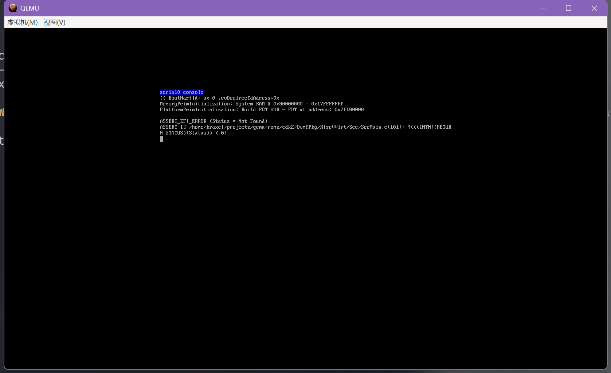](https://github.com/ayostl/OERV_pertask/tree/main/images/error1.png)

猜测可能是因为没有uefi启动，但是没找到解决方案

又找了一份文档，尝试以下脚本：

```sh
@echo off
chcp 65001
set vcpu=4
set memory=4
set drive=openEuler-22.09-riscv64-qemu-xfce.qcow2
set fw=fw_payload_oe_qemuvirt.elf
set ssh_port=12055

echo :: Starting VM...
echo :: Using following configuration

echo vCPU Cores: %vcpu%
echo Memory: %memory%G
echo Disk: %drive%
echo SSH Port: %ssh_port%

set path="F:\qemu";%PATH%
qemu-system-riscv64 `
  -nographic `
  -machine virt `
  -smp %vcpu% `
  -m %memory%G `
  -kernel "%fw%" `
  -bios none `
  -drive file=%drive%,format=qcow2,id=hd0 `
  -device virtio-vga `
  -device virtio-blk-device,drive=hd0 `
  -device virtio-net-device,netdev=usernet `
  -netdev user,id=usernet,hostfwd=tcp::"%ssh_port%"-:22 `
  -device qemu-xhci `
  -usb `
  -device usb-kbd `
  -device usb-tablet `
  -append "root=/dev/vda1 rw console=ttyS0 swiotlb=1 loglevel=3 systemd.default_timeout_start_sec=600 selinux=0 highres=off mem=512M earlycon"
```

尝试从源码构建：

> 参考资料：[QEMU Wiki](https://wiki.qemu.org/Hosts/W32 "点击跳转到 QEMU Wiki")

通过 Wiki 上的帮助文档一步步执行，其中 python 包中缺少一些依赖可以从该链接下载，以完成构建 [mysy2.packages 仓库](https://packages.msys2.org/ "点击跳转到 mysy2.packages 仓库")

但是我遇到了以下下错误：

[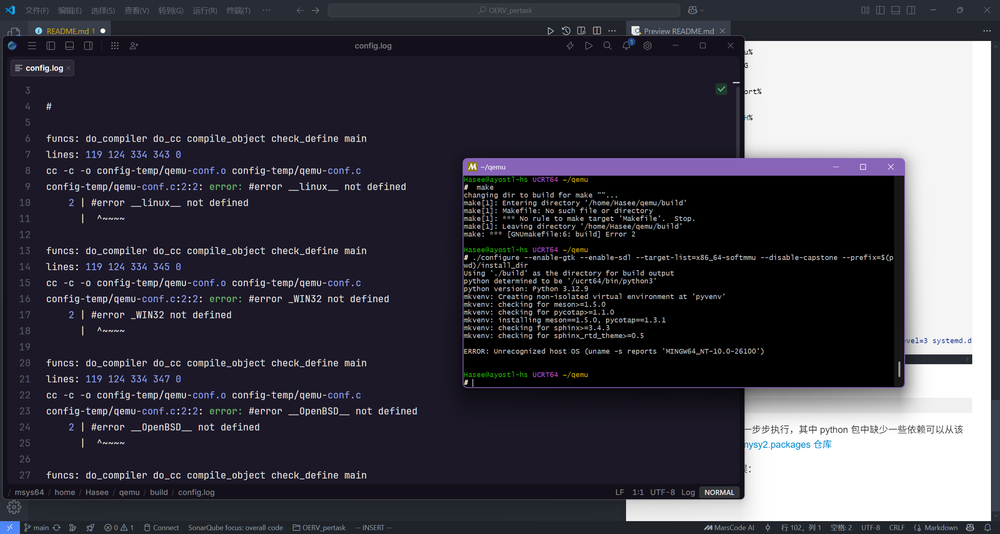](https://github.com/ayostl/OERV_pertask/tree/main/images/error2.png)

暂时拼劲全力无法解决（日后再去解决吧），转而使用 Wsl 方案，虚拟机看起来太抽象了，还是 Wsl 好一点

仓皇建立了一个 wsl 虚拟机，试图用 wsl 来安装 qemu 模拟 riscv 环境

[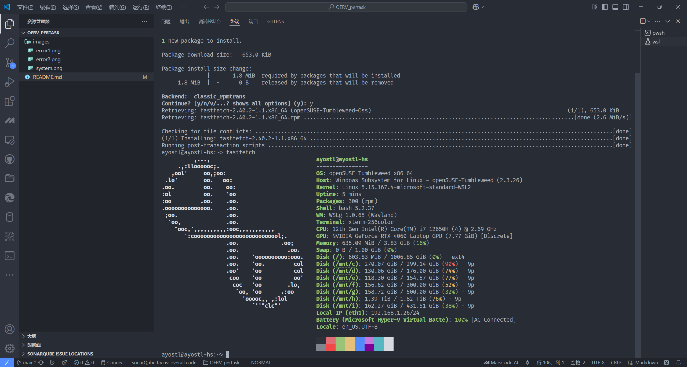](https://github.com/ayostl/OERV_pertask/tree/main/images/openSUSE.png "openSUSE WSL2")

重新从源码构建 qemu ,但是无法编译成功，在第一个错误的那个启动界面无限卡死，悲），以后有时间再研究吧

重新安装了一个 Ubuntu [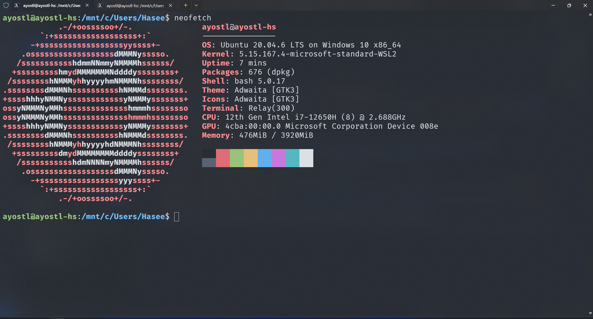](https://github.com/ayostl/OERV_pertask/tree/main/images/Ubuntu.png "Ubuntu WSL2")

使用 apt 命令安装 qemu 及其相关依赖

但是由于 Ubuntu 版本过低，无法使用 UEFI 启动，将 Ubuntu 升至 24.04 版本重新尝试

> 参考资料：[Ubuntu Boards documentation](https://canonical-ubuntu-boards.readthedocs-hosted.com/en/latest/how-to/qemu-riscv/)

结果居然异常的顺利，成功启动虚拟机，以下是启动代码：

```sh
qemu-system-riscv64 \
    -machine virt -nographic -m 2048 -smp 4 \
    -kernel /usr/lib/u-boot/qemu-riscv64_smode/uboot.elf \
    -device virtio-net-device,netdev=eth0 -netdev user,id=eth0 \
    -device virtio-rng-pci \
    -drive file=openEuler-24.03-LTS-SP1-riscv64.qcow2,format=qcow2,if=virtio

# machine 用于指定虚拟机启动模式，也可以用-m
# nographic 用于指定虚拟机不使用图形界面
# m 指定内存大小
# smp 指定 CPU 核心数
# kernel 指定 UEFI 启动的内核
# device 指定虚拟机设备
# netdev 指定网络设备
# drive 指定虚拟机磁盘
# format 指定磁盘格式
# if 指定磁盘接口
```

启动后出现以下界面：

[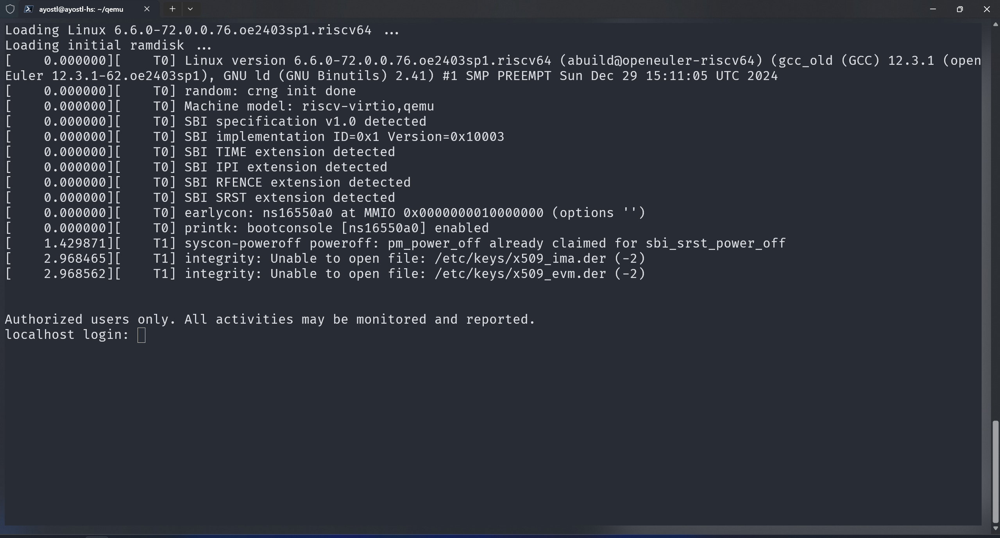](https://github.com/ayostl/OERV_pertask/tree/main/images/login.png "登录界面")

默认登录账户密码在 [openEuler 官网](https://docs.openeuler.org/zh/docs/24.03_LTS_SP1/docs/Releasenotes/%E5%B8%90%E5%8F%B7%E6%B8%85%E5%8D%95.html# "点此打开 openEuler 帐号清单")上能找到

输入账号密码后先，创建一个自用的用户，检查系统依赖然后通过 yum 命令 补全系统依赖，然后 通过 git 构建源码并 make 编译

结果如下：

[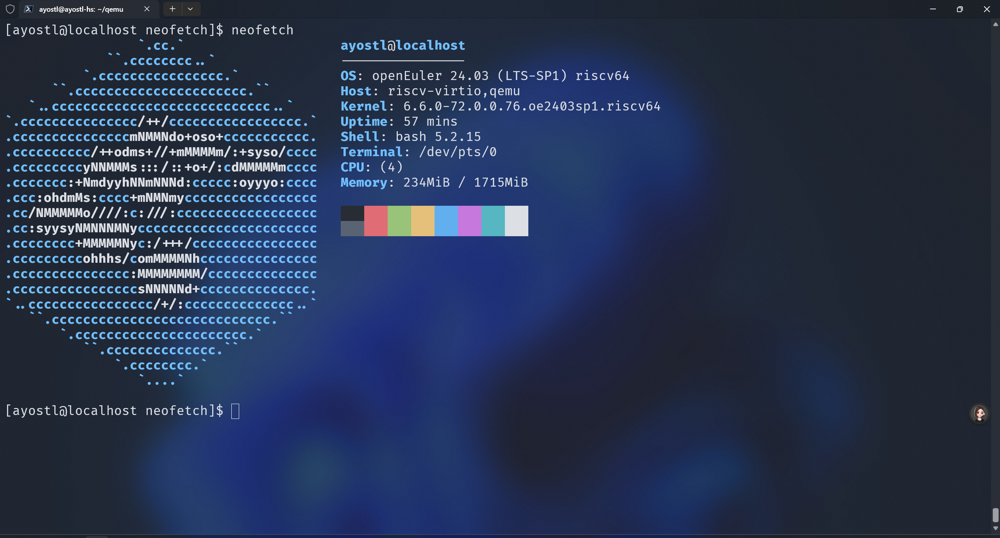](https://github.com/ayostl/OERV_pertask/tree/main/images/neofetch.png "neofetch 截图")

任务一完成！

## 任务二

> 任务二：在 openEuler RISC-V 系统上通过 obs 命令行工具 osc，从源代码构建 RISC-V 版本的 rpm 包，比如 pcre2。

第一步先在 openEuler 上安装 obs 命令行工具

> 参考资料：[如何在 openEuler 上使用 OBS 命令行工具](https://www.openeuler.org/zh/blog/fuchangjie/2020-03-26-how-to-OBS.html "如何在 openEuler 上使用 OBS 命令行工具") & [openSUSE Wiki](https://en.opensuse.org/openSUSE:Build_Service_Tutorial "点击打开 openSUSE Wiki")

注册一个 obs 账号后在本地构建一个 obs 的工作主目录，并通过 osc checkout home:username 命令把远程家目录和本地工作区建立连接

> 注意，这一步一定要去注册 [obs 国服](https://build.tarsier-infra.isrc.ac.cn "点击打开 obs 仓库（国服）")，不要注册 [obs 外服](https://build.opensuse.org/ "点击打开 obs 仓库（外服）")，不然你会一个仓库都 search 不到，我看的 Wiki 都是外服的链接，此处耽误2小时，希望大家引以为戒

开始我还寻思直接去找一下仓库，结果打不开，但是在 osc 中使用正常

[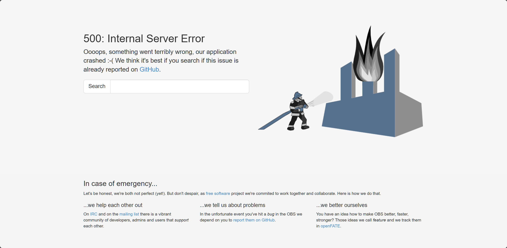](https://github.com/ayostl/OERV_pertask/tree/main/images/break.png "在建立项目时服务器崩了")

以下是我在 openEuler 构建 pcre2 包的过程：

```sh
# 进入 obs 工作主目录
osc checkout home:ayostl # 建立本地工作区
osc search pcre2 # 搜索 pcre2 包
osc co openEuler:24.03:SP1:Everything pcre2openSUSE:Factory pcre2
# 从源代码构建 pcre2 包（可以改成自己搜索到的仓库）
cd .../pcre2 # 进入 pcre2 目录
osc up -S # 根据_service文件从云端部署到本地
rm -f _service;for file in `ls | grep -v .osc`;do new_file=${file##*:};mv $file $new_file;done
osc addremove * # 重命名源文件，然后将重命名后的源文件添加到OBS暂存中
osc ci -m "update pcre2" --noservice # 提交 pcre2包
osc repos # 查看仓库
osc bulid 
```

构建完成，共耗时1934s（ cpu 太弱啦 `.....((/- -)/`）

[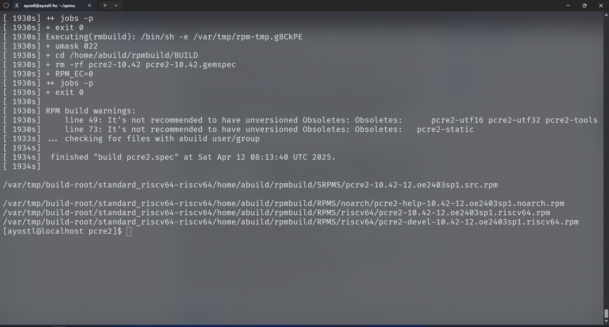](https://github.com/ayostl/OERV_pertask/tree/main/images/pretask2.png "构建完成")

任务二完成！

## 任务三

> 任务三：尝试使用 qemu user & nspawn 或者 docker 加速完成任务二
> 参考资料[Ubuntu OBS Wiki](https://www.xiexianbin.cn/linux/ubuntu/open-build-service/index.html "点击打开 Ubuntu OBS Wiki")

开始在 Ubuntu 上安装 osc 命令行工具，但是遇到以下问题，似乎是因为python3.4以后就不支持 imp 这个模块了，我的系统 python 是3.12.0，所以无法运行。但是我在寻找一圈无果后，发现可能是因为缺少对应的依赖而导致错误运行并非版本问题，然后使用修复依赖

```sh
sudo apt --fix-broken install
```

现在 osc 可以正常使用了


[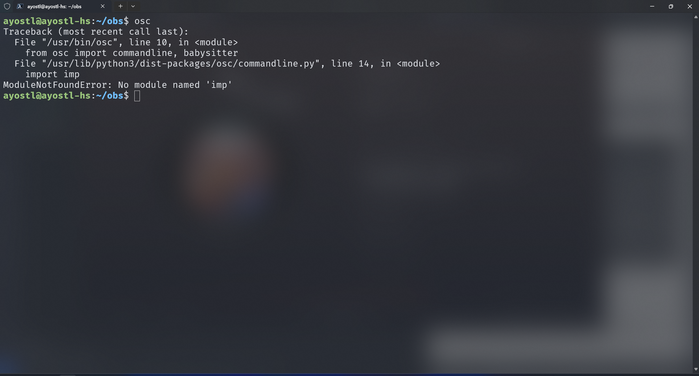](https://github.com/ayostl/OERV_pertask/tree/main/images/error3.png "osc 缺少imp")

在构建的过程中遇到了以下错误，试图尝试找到该问题的解决方案

[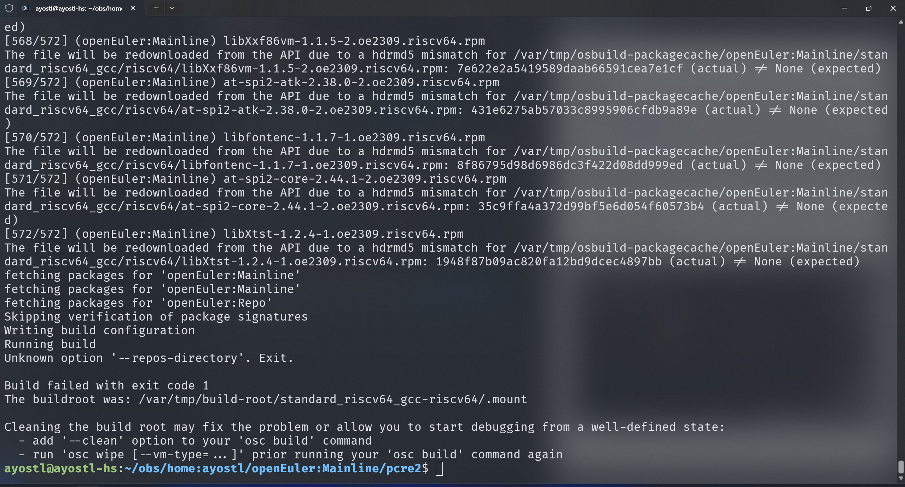](https://github.com/ayostl/OERV_pertask/tree/main/images/error4.png "unkown option")

找了4个小时无果，打算到时候再跟大家一起研究这些问题，先把任务三的工作完成了，我想到可能是因为 Ubuntu 24,04 LTS 的 obs 包版本过低，无法执行这些编译命令，所以我又回到 openSUSE 上重新构建了 pcre2 包，这次可以构建了（折磨我一下午，郁闷`╥﹏╥...`），但仍出现以下错误，试图解决

[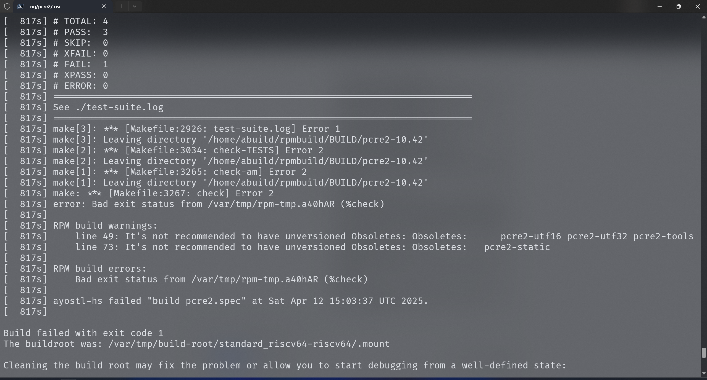](https://github.com/ayostl/OERV_pertask/tree/main/images/error5.png "异常退出")

构建太多次给 /var/tmp 干爆仓了，手动清理一下继续构建

在连续构建几个仓库都出现错误，后来发现可能是交换空间内存太小，重新设置了一下交换空间内存，问题解决（个人建议，如果 search 到的仓库无法构建一定要看一下 log 中的问题提示，比如依赖不全，或者空间大小不够）

构建共耗时1053s，使用 chroot 加速构建可以显著提升构建速度

[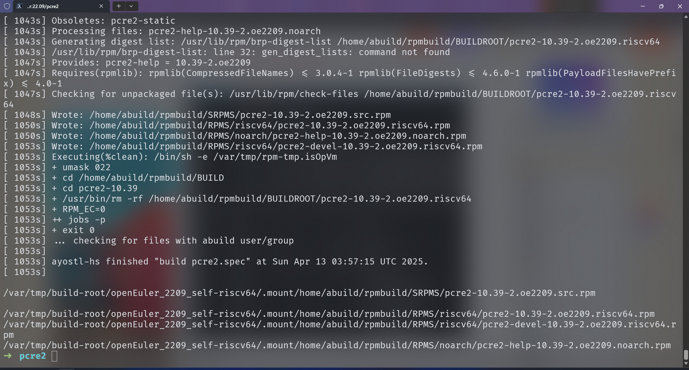](https://github.com/ayostl/OERV_pertask/tree/main/images/pretask3.png "pretask3")

任务三完成！

## 参考资料合集

### OERV 相关

[OERV 实习生指南](https://github.com/openeuler-riscv/oerv-team/blob/main/Intern/guide.md)

### 初始 openEuler 相关

[初试 openEuler（一）：windows 下使用 qemu 安装 openEuler](https://www.openeuler.org/zh/blog/traffic_millions/2020-03-27-qemu.html)

### QEMU 相关

[QEMU 下载页](https://qemu.weilnetz.de/w64/2019/)
[QEMU for Windows 20250326 下载](https://qemu.weilnetz.de/w64/qemu-w64-setup-20250326.exe)
[QEMU Wiki](https://wiki.qemu.org/Hosts/W32)
[mysy2.packages 仓库](https://packages.msys2.org/)
[Ubuntu Boards documentation](https://canonical-ubuntu-boards.readthedocs-hosted.com/en/latest/how-to/qemu-riscv/)

### openEuler 下载及文档相关

[openEuler 25.03 下载页](https://www.openeuler.org/zh/download/#openEuler%2025.03)
[openEuler 帐号清单](https://docs.openeuler.org/zh/docs/24.03_LTS_SP1/docs/Releasenotes/%E5%B8%90%E5%8F%B7%E6%B8%85%E5%8D%95.html)

### OBS 相关

[如何在 openEuler 上使用 OBS 命令行工具](https://www.openeuler.org/zh/blog/fuchangjie/2020-03-26-how-to-OBS.html)
[openSUSE Wiki](https://en.opensuse.org/openSUSE:Build_Service_Tutorial)
[obs 仓库（国服）](https://build.tarsier-infra.isrc.ac.cn)
[obs 仓库（外服）](https://build.opensuse.org/)
[Ubuntu OBS Wiki](https://www.xiexianbin.cn/linux/ubuntu/open-build-service/index.html)

### 其他人的 pretask PR（感谢）

[张天泽](https://github.com/openeuler-riscv/oerv-team/pull/1760)
[ccrysisa](https://ccrysisa.github.io/posts/oerv-pretask/)
